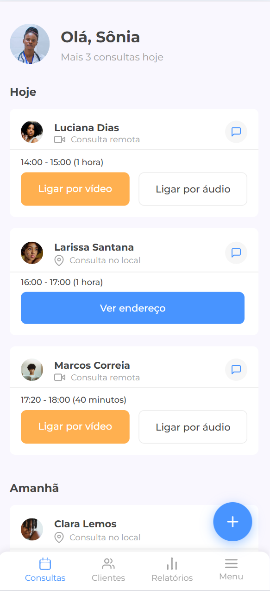
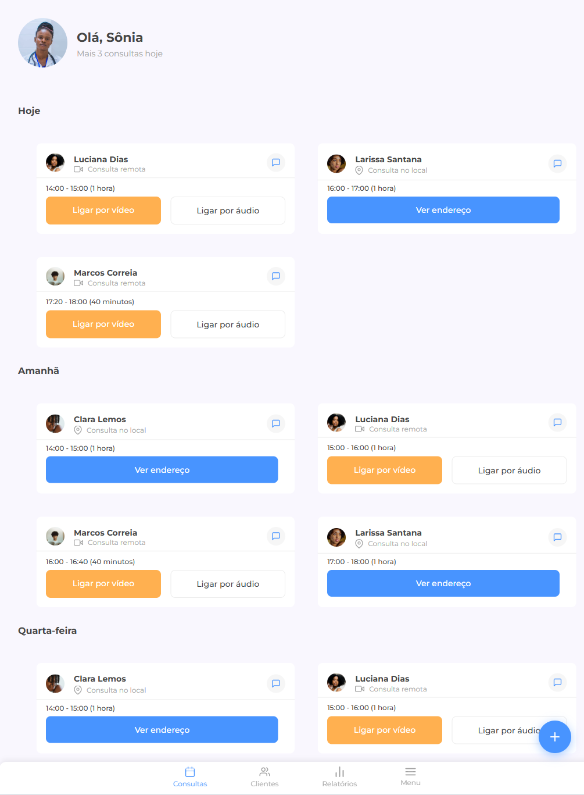
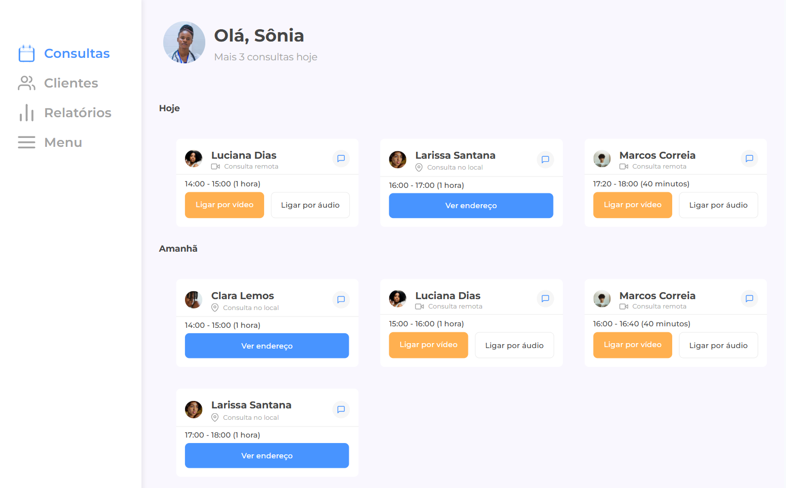

# Projeto do Desafio 7 Days of Code de responsividade durante curso de HTML-CSS na Alura.

            

## Ferramentas utilizadas:

* HTML

* CSS

* FLEXBOX

## Descrição

Projeto desenvolvido durante o desafio 7 Days of Code buscando a pratica da responsividade.

## Experiencia

Tive um pouco de dificuldade desenvolvendo o desafio. Tentei fazer da maneira que preferi, mas acredito que minha falta de experiencia tenha me feito duvidar um pouco de que estava seguindo o caminho certo. Deixei pela metade, terminei o projeto e no fim, resolvi checar o resultado da instrutora. 
Apos alguns minutos consegui entender e percebi que estava no caminho certo! Logo, apenas continuei estilizando como preferia, adaptei algumas linhas do codigo onde queria que fosse diferente e cheguei ao resultado que buscava. 

## Feito por:

### MNynee (Matheus Faustino)

#7DaysOfCode
